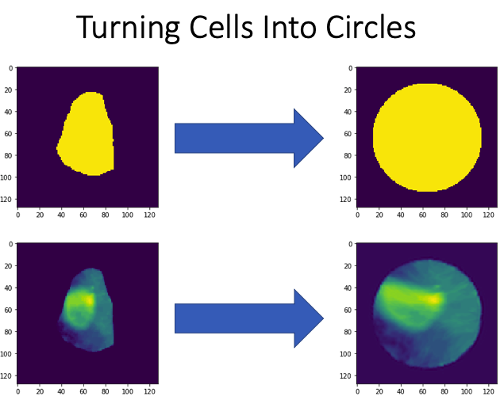
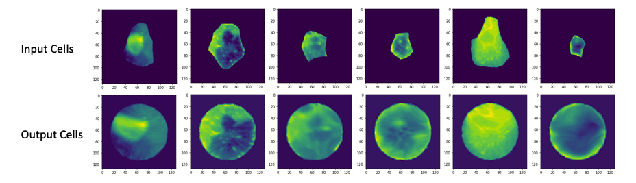

# Cells2Circles
Turns Amorphous Cells to Circles for Easier Analysis Disreagarding Shape and Size.
This work is first published and citable at: https://www.biorxiv.org/content/10.1101/2021.04.22.441005v2

## Introduction
This is an image processing pipeline that takes input Segmented Single Cell Images on a black background, and turns the amorphous shaped cells into uniform circles. This allows cells to analyzed in a method that is agnostic to their shapes and sizes to prevent irrelevant variables from confounding data analysis.

  

 

  

## Method
This pipeline creates a deformation field by registering the binary cell mask to a target binary circle mask (using non-rigid registration). This deformation field is then applied to the cell image to deform it into a circle. Post processing steps (converting image to uint8 and resizing the single channel image were necessary for the project this tool was developed for, and should be changed and customized to suit your project's needs.

## Prerequisites
- Linux or macOS
- NVIDIA GPU (memory suitable for image size) + CUDA cuDNN
- Simple Elastix Registration Tool: https://github.com/SuperElastix/SimpleElastix
- Tested on Python 3.7.7

